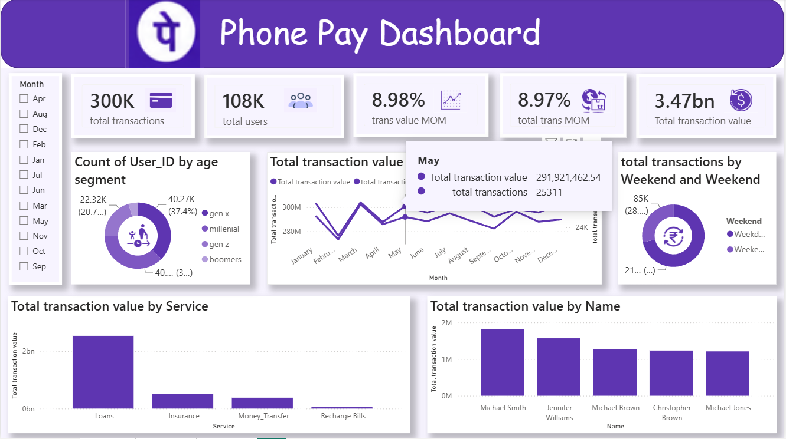

# 📊 PhonePe Transaction Analysis Dashboard | Power BI


## 📌 Project Overview

This project is an interactive **PhonePe Transaction Analysis Dashboard** built using **Microsoft Power BI**. The dashboard provides insights into digital payment trends by analyzing transaction volume, transaction value, user distribution, and state-wise performance.

The project demonstrates the complete Power BI workflow including:

- Data Cleaning
- Data Transformation
- Data Modeling
- DAX Calculations
- Interactive Dashboard Design
- KPI Development
- Business Insights

---

## 🚀 Dashboard Features

### 📈 KPIs

- Total Transactions
- Total Transaction Amount
- Average Transaction Value
- Month-over-Month Growth
- Success Rate
- Total Users

---

### 📊 Visualizations

- State-wise Transaction Analysis
- Monthly Transaction Trend
- Transaction Category Distribution
- Payment Type Analysis
- Top Performing States
- Interactive Filters & Slicers
- Dynamic KPI Cards

---

## 🛠️ Tech Stack

- Microsoft Power BI
- Power Query
- DAX
- Microsoft Excel
- Data Modeling
- JSON Custom Theme

---

## 📂 Project Structure

```
PhonePe-PowerBI-Dashboard/
│
├── Phonepe-Final-Dataset.xlsx
├── phonepay_visualization.pbix
├── phone_pay_modern_theam.json
├── Dashboard Screenshot.png
└── README.md
```

---

## 📊 Data Preparation

The dataset was cleaned and transformed using **Power Query**.

Steps performed:

- Removed duplicate records
- Handled missing values
- Corrected data types
- Created calculated columns
- Built relationships
- Optimized data model

---

## 📐 Data Model

The dashboard follows a clean star-schema approach where fact and dimension tables are connected for better performance and accurate calculations.

---

## 📏 DAX Measures Used

Examples of DAX measures created:

```DAX
Total Transactions = COUNT(Transaction_ID)

Total Amount = SUM(Transaction_Amount)

Average Transaction Value =
DIVIDE([Total Amount],[Total Transactions])

MoM Growth % =
DIVIDE(
Current Month Sales-Previous Month Sales,
Previous Month Sales
)

Success Rate =
DIVIDE(Successful Transactions,Total Transactions)
```

---

## 🎨 Dashboard Theme

A custom PhonePe-inspired theme was created using a JSON theme file.

Theme highlights:

- Purple color palette
- Modern KPI cards
- Clean typography
- Minimalistic visuals
- Consistent branding

---

## 📈 Business Insights

The dashboard helps answer questions such as:

- Which states generate the highest transaction volume?
- What is the monthly transaction trend?
- Which payment category contributes the most?
- How is transaction growth changing month over month?
- What is the average transaction value?
- Which regions need business attention?

---

## 📷 Dashboard Preview


markdown


---

## 💡 Skills Demonstrated

- Data Cleaning
- Data Transformation
- Data Visualization
- Dashboard Design
- DAX
- Power Query
- Data Modeling
- Business Intelligence
- KPI Design
- Analytical Thinking

---

## 🎯 Learning Outcomes

Through this project I learned:

- Building interactive dashboards
- Writing DAX measures
- Designing professional KPI cards
- Creating custom Power BI themes
- Data modeling best practices
- Turning raw data into actionable insights

---

## 📬 Connect With Me

**Mamta Mukate**

📧 Email: *mamtamukate@email.com*

🔗 LinkedIn: *(https://www.linkedin.com/in/mamta-mukate-a7ab622a3/)*

💻 GitHub: *https://github.com/mamtamukate*

---

## ⭐ If you found this project useful, consider giving it a Star!
